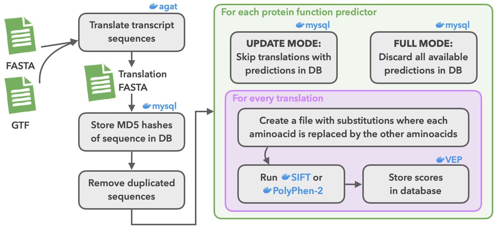

# Predict protein function with SIFT and PolyPhen-2

This pipeline predicts amino acid substitutions using SIFT and, for human
proteins, PolyPhen-2. It accepts peptide FASTA files or translates GTF/FASTA
inputs with AGAT. Translation MD5 hashes identify the resulting prediction
matrices.



## Requirements

Use Nextflow with the legacy parser and the configured SIFT, PolyPhen-2, VEP and
AGAT containers. See [nextflow.config](nextflow.config) for profiles and
[pipeline_transfer.md](pipeline_transfer.md) for external data and API dependencies.
Offline mode avoids MySQL but still requires Ensembl Perl APIs.

## Run

This example runs SIFT on supplied peptides and writes SQLite output:

```bash
nextflow run nextflow/ProteinFunction/main.nf \
  -profile slurm \
  --translated peptides.fa \
  --species homo_sapiens \
  --sift_run_type FULL \
  --blastdb /path/to/sift_database \
  --offline true \
  --outdir results
```

Choose a run type separately for `--sift_run_type` and `--pph_run_type`:

- `NONE`: skip the predictor (default).
- `UPDATE`: in online mode, skip translations already stored in MySQL.
- `FULL`: in online mode, replace the predictor's existing results.

Offline `FULL` and `UPDATE` both process the supplied translations. PolyPhen-2
requires human input and `--pph_data`.

## Options

| Option | Purpose |
| --- | --- |
| `--translated` | Peptide FASTA files, comma-separated |
| `--gtf`, `--fasta` | Annotation and genomic sequence files if peptides are not supplied |
| `--species` | Species name; defaults to `homo_sapiens` |
| `--outdir` | Output directory; defaults to `outdir` |
| `--host`, `--port`, `--user`, `--pass`, `--database` | Required MySQL connection settings in online mode |
| `--offline` | Disable MySQL; defaults to `false` |
| `--sqlite` | Enable SQLite output; defaults to the value of `--offline` |
| `--sqlite_dir` | SQLite output directory; defaults to `--outdir` |
| `--sqlite_db` | Full SQLite output path; overrides `--sqlite_dir` |
| `--blastdb` | SIFT-formatted BLAST database path |
| `--median_cutoff` | SIFT alignment cutoff; defaults to `2.75` |
| `--pph_data` | PolyPhen-2 data directory |

## Outputs

Predictions use the [Ensembl matrix format](https://www.ensembl.org/info/genome/variation/prediction/protein_function.html#nsSNP_data_format).
Online runs store results in MySQL. SQLite output combines per-task databases
into `<species>_PolyPhen_SIFT.db` and contains predictions from the current run.
Failure reasons are written to `failure_reason.tsv`.
