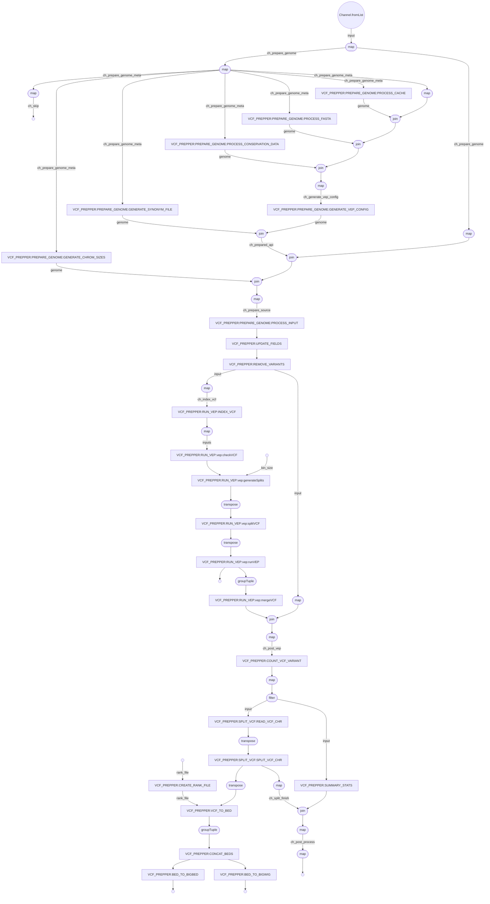

# vcf_prepper

Generates and process data required for the new Ensembl website.

## Pre-requisite

### Repositories

Following repositories are needed for this pipeline - 

- `ensembl-variation`
- `ensembl-vep`
- `ensembl` 
- `VEP_plugins`

Make sure you have checked out to correct branch of these repositories.

### Python dependencies

The python dependencies are currently available in `variation-eva` pyenv environment. To have access to this environment please add these to your `.bashrc` - 

```
PYENV_ROOT="/hps/software/users/ensembl/variation/.pyenv"
if [[ -d "$PYENV_ROOT" ]]; then
    export PYENV_ROOT
    export PATH="$PYENV_ROOT/bin:$PATH"
    eval "$(pyenv init --path)"
    eval "$(pyenv init -)"
    eval "$(pyenv virtualenv-init -)"
fi
```

### Rust setup (only for development)

These pipeline uses some Rust executables. If you want to develop or test those, you need to have Rust installed in your environment. If you just want to run the pipeline, you don't need to worry about Rust setup as the executables are available in the `bin` directory of the repository.

You currently need to install rust environment using your codon user. Run the following command - 

```
curl https://sh.rustup.rs -sSf | sh
```

## Usage

Example command:

```
module add nextflow-22.10.1-gcc-11.2.0-ju5saqw

nextflow \
run ${ENSEMBL_ROOT}/ensembl-variation-pipelines/nextflow/vcf_prepper \
  -profile slurm \
  --input_config <path/to/input_config.json> \
  --output_dir <path/to/output_dir> \
  --ini_file <path/to/ini_file>
```

## Options


### `version` (optional, default: `110`)
Give the Ensembl version to be used. It is used to get the appropriate Ensembl core database when creating and/or processing configs.

### `release_id` (optional, default: `6`)
The target release in form of release_id (from metadata database).

### `repo_dir` (mandatory)
The location of the Ensembl repositories. The pipeline will look for Ensembl repositories such as `ensembl-variation`, `ensembl-vep`, `ensembl`, `VEP_plugins` in this location.

### `output_dir` (optional, default: `launchDir`)

Give the full path of the dir where the outputs will be generated. By default, it will be the directory from where you are running the pipeline. Make sure you have write access to this directory.

The generated VEP-ed VCF and track files will be stored there. The directory structure would be:

```
<output_dir>/
├── api/
│   ├── <genome uuid 1>/
│   │   ├── variation.vcf.gz
│   │   └── variation.vcf.gz.tbi
│   └── <genome uuid 2>/
│       ├── variation.vcf.gz
│       └── variation.vcf.gz.tbi
└── tracks/
    ├── <genome uuid 1>/
    │   ├── variant-dbsnp-details.bb
    │   ├── variant-dbsnp-summary.bw
    │   ├── variant-details.bb -> variant-dbsnp-details.bb
    │   └── variant-details.bb -> variant-dbsnp-details.bb
    └── <genome uuid 2>/
        ├── variant-eva-details.bb
        ├── variant-eva-summary.bw
        ├── variant-details.bb -> variant-eva-details.bb
        └── variant-details.bb -> variant-eva-details.bb
```

### `temp_dir` (optional, default: `launchDir/tmp`)
Give the full path of the temporary directory to be used by the pipeline. By default, it will be a `tmp` directory inside the output directory. Make sure you have write access to this directory.

### `input_config` (mandatory)
Give the full path of the input configuration file.

This is a json configuration file containing the input file and related metadata information.

```
{
  "homo_sapiens_GRCh38" : [
    {
        "genome_uuid": "12345678-90ab-cdef-ghij-klmnopqrstuv",
        "species": "homo_sapiens",
        "assembly": "GRCh38",
        "source_name": "dbSNP",
        "file_location": "/path/to/GCF_000001405.39_VEP.vcf.gz",
        "file_type": "local"
    }
  ]
}
```
- `homo_sapiens_GRCh38`: This should be `<species>_<assembly>` where species is the production_name and assembly is the assembly_default.

- `genome_uuid`: We only update the latest partial or (in some rare cases) latest integrated genome. See which one you are updating and make sure to use the correct genome_uuid. It will involve querying the metadata database.

- `species`: Use the species production_name value from metadata db from genome table.

- `assembly`: Use the assembly_default value from metadata db from assembly table.

- `source_name`: Specify the name of the source of the VCF file.

- `file_location`: Update with the full path of the source VCF file.

- `file_type`: Specify the type of the source file. It can be `local` or `remote`.

- `sources`: In some special cases where we have multiple sources in a VCF file, we set source_name to `MULTIPLE` and provide the source names in the `sources` field as a list of strings.

### `vep_config` (optional, default: `ensembl-variation-pipelines/nextflow/vcf_prepper/assets/vep_config.json`)
Give the full path of the VEP configuration file.

The VEP configuration file must be a JSON file matching the following schema:

#### Structure

The top-level object contains:

- `annotation_source`: Object describing sources for cache, FASTA, and GFF files.
  - `cache`: 
    - `active`: (boolean) specifies if cache is used
    - `dir`: (string) directory path for cache files
    - `version`: (integer) cache version
    - `factory`: (string) factory to use in case we need to fetch and process cache files
  - `fasta`: 
    - `active`: (boolean) specifies if FASTA is used
    - `dir`: (string) directory path for FASTA files, fasta files are expected in this dir
    - `file`: (string) or, provide full path to the FASTA file
    - `factory`: (string) factory to use in case we need to fetch and process FASTA files
  - `gff`: 
    - `active`: (boolean) specifies if GFF is used
    - `dir`: (string) directory path for GFF files, GFF files are expected in this dir
    - `file`: (string) or, provide full path to the GFF file
    - `factory`: (string) factory to use in case we need to fetch and process GFF files
- `default_options`: Object specifying default VEP options.
  - `force_overwrite`, `fork`, `buffer_size`, `vcf`, `spdi`, `variant_class`, `protein`, `transcript_version`, `gencode_promoter`, `offline`, `sift`, `polyphen`, `af_1kg` etc. with their respective values.
- `plugins`: Object describing plugin configuration.
  - `genome_matcher`: string, the matcher class to use for matching the genome against avaialble plugins.
  - `confs`: array of plugin config objects, each with:
    - `name`: (string) name of the plugin
    - `requires_file`: (boolean) specifies if the plugin requires a file
    - `keyed`: (boolean) specifies if the plugin params are keyed
    - `args`: array of param objects (e.g., `{ key: string }`), replaces any default value generated by the pipeline for the plugin.
- `custom_annotaions`: Object describing custom annotation configuration.
  - `confs`: array of custom annotation config objects, each with:
    - `name`: (string) name of the custom annotation, e.g. - frequency, citation etc.
    - `genome_matcher`: (string) the matcher class to use for matching the genome against this custom annotation. NOT IMPLEMENTED YET.
    - `args`: array of param objects (e.g., `{ short_name: string, file: string, format: string, type: string, coord: integer }`), replaces any default value generated by the pipeline for the custom annotation. Currently it will override all custom lines under a certain annotation, e.g. - gnomAD and 1000Genomes frequency.

#### Example

```json
{
  "annotation_source": {
    "cache": { "active": true, "dir": "/path/to/cache", "version": 110, "factory": "old" },
    "fasta": { "active": true, "dir": "/path/to/fasta", "file": "genome.fa", "factory": "current" },
    "gff": { "active": false }
  },
  "default_options": {
    "force_overwrite": 1,
    "fork": 4,
    "buffer_size": 1000,
    "vcf": 1,
    "spdi": 1,
    "variant_class": 1,
    "protein": 1,
    "transcript_version": 1,
    "gencode_promoter": 1,
    "offline": 1,
    "sift": 1,
    "polyphen": 1,
    "af_1kg": 1
  },
  "plugins": {
    "confs": [
      {
        "name": "PluginA",
        "requires_file": true,
        "keyed": false,
        "files": [{ "snv": "fileA.txt" }],
        "file_factory": "current",
        "params": [{ "key": "value" }]
      }
    ]
  },
  "custom_annotaions": {
    "confs": [
      {
        "name": "CustomA",
        "file_factory": "current",
        "params": [
          {
            "short_name": "shortA",
            "file": "customA.txt",
            "format": "txt",
            "type": "custom",
            "coord": 1
          }
        ]
      }
    ]
  }
}
```

### `ini_file` (mandatory)
A INI file that is used by the `createConfigs` step to generate the config files.

The file format is -
```
[core]
host = <hostname>
port = <port>
user = <user>

[metadata]
host = <hostname>
port = <port>
user = <user>
```

Add the appropriate server information so that the core database related to the species and Ensembl version can be found.

### `rank_file` (optional, default: `ensembl-variation-pipelines/nextflow/vcf_prepper/assets/variation_consequnce_rank.json`)
Give the full path of the rank file to be generated and used.

This rank file contains the rank of variant consequence and used to determine the most severe consequence of a variant. The pipeline generate this file automatically using Ensembl Variation api and later use it in the `vcfToBed` step.

Make sure you are checked out to appropriate `ensembl-variation` repository to get the appropriate ranks. ideally it would be the same version as provided by the `--version` parameter.

### `population_data_file` (optional, default: `ensembl-variation-pipelines/nextflow/vcf_prepper/assets/population_data.json`)
Give the full path of the population data file to be used.

### `sources_meta_file` (optional, default: `ensembl-variation-pipelines/nextflow/vcf_prepper/assets/sources_meta.json`)
Give the full path of the sources meta file to be used.

### `bed_fields` (optional, default: `ensembl-variation-pipelines/nextflow/vcf_prepper/assets/bed_fields.json`)
Give the full path of the bed fields file to be used.

### `structural_variant` (optional, default: `0`)
If value is 1, the pipeline will process structural variant VCFs. If 0, it will treat input file as short variant VCFs.

### `bin_size` (optional, default: `250000`)
This is a nextflow-vep pipeline parameter and determines the number of variants to split the VCF file by.

### `remove_nonunique_ids` (optional, default: `1`)
If value is 1, the pipeline will ignore duplicate variants with same variant name.

### `remove_patch_regions` (optional, default: `1`)
If value is 1, the pipeline will ignore sequence region with `PATCH`, `TEST`, `CTG` in name.

### `skip_vep` (optional, default: `0`)
If value is 1, the pipeline will skip running `nextflow-vep`. If skipped, input VCFs must already be processed by VEP.

### `skip_tracks` (optional, default: `0`)
If value is 1, the pipeline will skip creating track files.

### `skip_stats` (optional, default: `0`)
If value is 1, the pipeline will skip updating API files with stats.

### `rename_clinvar_ids` (optional, default: `1`)
If value is 1, the pipeline will try to convert id of the ClinVar VCF from ClinVar accession to ClinVar variant ID.

### `queue_size` (optional, default: `1200`)
This is a nextflow-vep pipeline parameter and determines the number of jobs to be submitted to the cluster at a time.

### `queue` (optional, default: `production`)
This is a nextflow-vep pipeline parameter and determines the queue to which the jobs will be submitted.

## Pipeline Flow



Note: generated by `with-dag` param of nextflow.

## Testing & CI

Unit tests are now available for all modules, subworkflows, workflows, and functions. Continuous Integration (CI) runs linting, builds Rust binaries, and builds/tests the Python `ensembl-variation-utils` package.